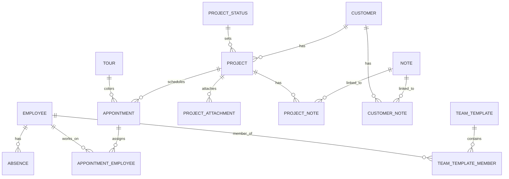

# Aufgabe 2 – Domänenmodell (Text + Mermaid-ER)

## Domänenmodell in Worten
Das System ist projektzentriert: **Projekt** bildet die fachliche Klammer. Alles Fachliche (Beschreibung als Markdown, Notizen, Anhänge) hängt am Projekt. **Termine** sind reine Zeitblöcke (ganztägig) und existieren nur innerhalb eines Projekts. **Touren** sind optionale Ordnungsobjekte, die ausschließlich die farbliche Darstellung von Terminen steuern. **Mitarbeiter** werden Terminen zugewiesen; **Abwesenheiten** werden als eigene Zeiträume gepflegt und bei der Planung geprüft. **Team‑Vorlagen** dienen als Eingabehilfe für Mehrfachzuweisungen.

Notizen sind als gemeinsames Domainobjekt **Note** modelliert und werden sowohl Projekten als auch Kunden über Relationstabellen zugeordnet. Dadurch gibt es kein separates Freitextfeld am Kunden und keine Notizen am Termin.

## ER‑Diagramm (Mermaid)

## Objekt-/Relationsmatrix (kompakt)

- **Project**
  - FK → Customer, ProjectStatus
  - 1:n → Appointment, ProjectAttachment
  - n:m → Note (über project_note)
- **Customer**
  - 1:n → Project
  - n:m → Note (über customer_note)
- **Appointment**
  - FK → Project (pflicht), Tour (optional)
  - n:m → Employee (Zuweisung)
- **Employee**
  - 1:n → Absence
  - n:m → TeamTemplate (Mitgliedschaft)
- **Tour**
  - 1:n → Appointment (optional am Termin)
- **TeamTemplate**
  - n:m → Employee
- **Note**
  - n:m → Project (project_note)
  - n:m → Customer (customer_note)
