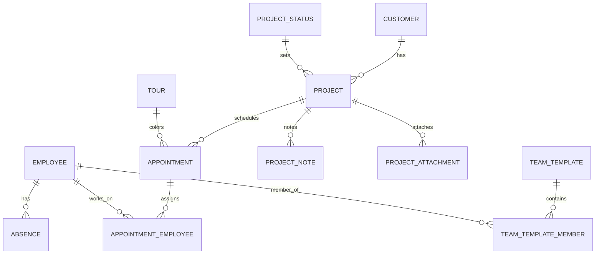

# Lastenheft – Gesamtübersicht (Objekte & Beziehungen)

Stand: Projektzentriertes Lastenheft nach FT (01)–FT (13).

## Zentrale Domänenobjekte

### Projekt (zentral)
- Repräsentiert einen Auftrag/Vorgang (z. B. Aufbau, Service, Nachbesserung).
- Beziehungen:
  - genau **1 Kunde**
  - genau **1 Projektstatus**
  - **0..n Termine**
  - **0..n Projektnotizen**
  - **0..n Projektanhänge**

### Kunde
- Kundenstammdaten, werden von Projekten referenziert.
- Kunden werden **nicht** physisch gelöscht, sondern können deaktiviert/archiviert werden.

### Projektstatus
- Pflegbare Statusliste (DB-Tabelle).
- Default-Statuswerte sind geschützt (nicht löschbar).
- Projekte referenzieren genau einen Status.

### Termin
- Reine Planungseinheit (ganztägig) mit Startdatum und optional Enddatum.
- Beziehungen:
  - gehört immer zu genau **1 Projekt**
  - optionale **Tour**
  - **0..n Mitarbeiter**
- Notizen/Anhänge/Beschreibung gehören **nicht** zum Termin, sondern zum Projekt.

### Mitarbeiter
- Mitarbeiterstammdaten.
- Beziehungen:
  - **0..n Termine** (Zuweisung)
  - **0..n Abwesenheiten**

### Abwesenheit
- Zeitraumbezogen (Start/Ende) je Mitarbeiter.
- Typen: Urlaub, Krankheit.
- Wird prüfend in der Terminplanung verwendet (Warnung/Blockade je nach Regel).

### Tour
- Ordnungsobjekt zur visuellen Struktur (Farbe).
- Beziehungen:
  - **0..n Termine**
- Keine Routen-, Fahrzeug-, Personal- oder Zeitlogik.

### Team-Vorlage
- Reine Eingabehilfe: Bezeichnung + Liste aktiver Mitarbeiter.
- Wird beim Termin anwenden als Vorschlag genutzt; am Termin wird immer die konkrete Mitarbeiterliste gespeichert.
- Keine Historie, keine Rückwirkung.

### Externe Kalender / Datei-Fallback
- Read-only Fallback-Sichten:
  - pro Team ein externer Kalender
  - zusätzlich ein zentraler Planungskalender
  - Excel-Export als Momentaufnahme
- Synchronisationsstatus wird überwacht.

---

## Beziehungen (kompakt)

- **Customer 1 — n Project**
- **ProjectStatus 1 — n Project**
- **Project 1 — n Appointment (Termin)**
- **Tour 1 — n Appointment** (optional am Termin)
- **Appointment n — m Employee** (Terminzuweisung)
- **Employee 1 — n Absence**
- **TeamTemplate n — m Employee** (Vorlagen-Mitglieder)
- **Project 1 — n ProjectNote**
- **Project 1 — n ProjectAttachment**

---

## Feature-zu-Objekt-Mapping (Kurz)

- **FT (13) Projektverwaltung**: Project, ProjectStatus, Customer-Referenz, Term-Existenz als Voraussetzung
- **FT (02) Projekt-Details**: Project.Description (Markdown), ProjectNote, ProjectAttachment
- **FT (09) Kundenverwaltung**: Customer
- **FT (01) Kalendertermine**: Appointment, Appointment↔Employee, Appointment↔Tour (optional)
- **FT (04) Tourenplanung**: Tour, Tour→Termine anzeigen
- **FT (05) Mitarbeiterverwaltung**: Employee, Mitarbeiter-Termindarstellung (aus Relation)
- **FT (08) Abwesenheiten**: Absence, Prüfregeln bei Planung
- **FT (11) Team-Vorlagen**: TeamTemplate, TeamTemplate↔Employee
- **FT (03) Kalenderansichten**: reine Sichten auf Appointment (+ Filter Tour)
- **FT (12) Dispositionsübersichten**: Wochenbasierte Ableitungen aus Appointment↔Employee↔Tour
- **FT (10) Monitoring**: Ableitungen/Listen aus Appointment-Daten (informativ)
- **FT (06) Druck**: Ausgaben aus bestehenden Sichten (keine Datenänderung)
- **FT (07) Fallback**: Kalender-Anbindung, Sync-Status, Excel-Export

---

# Aufgabe 2 – Domänenmodell (Text + Diagramm)

## Domänenmodell in Worten
Das System ist projektzentriert: **Projekt** bildet die fachliche Klammer. Alles Fachliche (Beschreibung als Markdown, Notizen, Anhänge) hängt am Projekt. **Termine** sind reine Zeitblöcke (ganztägig) und existieren nur innerhalb eines Projekts. **Touren** sind optionale Ordnungsobjekte, die ausschließlich die farbliche Darstellung von Terminen steuern. **Mitarbeiter** werden Terminen zugewiesen; **Abwesenheiten** werden als eigene Zeiträume gepflegt und bei der Planung geprüft. **Team-Vorlagen** dienen nur als Eingabehilfe zur Mehrfachzuweisung, ohne Rückwirkung auf bestehende Termine.

## ER-Diagramm (Mermaid)


## Objekt-/Relationsmatrix (sehr kompakt)
- **Project**
  - FK → Customer, ProjectStatus
  - 1:n → Appointment, ProjectNote, ProjectAttachment
- **Appointment**
  - FK → Project (pflicht), Tour (optional)
  - n:m → Employee (Zuweisung)
- **Employee**
  - 1:n → Absence
  - n:m → TeamTemplate (Mitgliedschaft)
- **Tour**
  - 1:n → Appointment (optional am Termin)
- **TeamTemplate**
  - n:m → Employee

---

# Vollständiges DB Schema (PostgreSQL DDL)

Hinweis: Dieses Schema folgt den in FT (01)–FT (13) beschriebenen Beziehungen.  
Die harte Regel „Mitarbeiter darf sich zeitlich nicht überschneiden“ ist fachlich zwingend, wird aber üblicherweise per Transaktionsprüfung oder Trigger durchgesetzt.

```sql
-- =========================================
-- Master / Stammdaten
-- =========================================

CREATE TABLE customer (
  id              uuid PRIMARY KEY,
  first_name      text NOT NULL DEFAULT '',
  last_name       text NOT NULL DEFAULT '',
  full_name       text NOT NULL,
  phone           text NOT NULL,
  street          text NOT NULL DEFAULT '',
  zip             text NOT NULL DEFAULT '',
  city            text NOT NULL DEFAULT '',
  is_active       boolean NOT NULL DEFAULT true
);

CREATE TABLE project_status (
  id              uuid PRIMARY KEY,
  name            text NOT NULL UNIQUE,
  sort_order      integer NOT NULL DEFAULT 0,
  is_default      boolean NOT NULL DEFAULT false,
  is_active       boolean NOT NULL DEFAULT true
);

CREATE TABLE tour (
  id              uuid PRIMARY KEY,
  name            text NOT NULL UNIQUE,
  color_hex       text NOT NULL
);

CREATE TABLE employee (
  id              uuid PRIMARY KEY,
  first_name      text NOT NULL DEFAULT '',
  last_name       text NOT NULL DEFAULT '',
  is_active       boolean NOT NULL DEFAULT true
);

-- =========================================
-- Zentrale Einheit: Projekt
-- =========================================

CREATE TABLE project (
  id                   uuid PRIMARY KEY,
  customer_id           uuid NOT NULL REFERENCES customer(id),
  status_id             uuid NOT NULL REFERENCES project_status(id),
  title                text NOT NULL,
  description_markdown  text NULL,
  is_active             boolean NOT NULL DEFAULT true
);

CREATE TABLE project_note (
  id          uuid PRIMARY KEY,
  project_id  uuid NOT NULL REFERENCES project(id) ON DELETE CASCADE,
  content     text NOT NULL
);

CREATE TABLE project_attachment (
  id          uuid PRIMARY KEY,
  project_id  uuid NOT NULL REFERENCES project(id) ON DELETE CASCADE,
  file_name   text NOT NULL,
  mime_type   text NOT NULL DEFAULT 'application/octet-stream',
  file_bytes  bytea NOT NULL
);

-- =========================================
-- Termine (reine Zeitplanung) + Zuweisungen
-- =========================================

CREATE TABLE appointment (
  id          uuid PRIMARY KEY,
  project_id  uuid NOT NULL REFERENCES project(id) ON DELETE RESTRICT,
  start_date  date NOT NULL,
  end_date    date NULL,
  tour_id     uuid NULL REFERENCES tour(id),
  CHECK (end_date IS NULL OR end_date >= start_date)
);

CREATE TABLE appointment_employee (
  appointment_id uuid NOT NULL REFERENCES appointment(id) ON DELETE CASCADE,
  employee_id    uuid NOT NULL REFERENCES employee(id),
  PRIMARY KEY (appointment_id, employee_id)
);

-- =========================================
-- Abwesenheiten (Urlaub/Krankheit)
-- =========================================

CREATE TABLE absence (
  id          uuid PRIMARY KEY,
  employee_id uuid NOT NULL REFERENCES employee(id) ON DELETE CASCADE,
  start_date  date NOT NULL,
  end_date    date NOT NULL,
  type        text NOT NULL,
  CHECK (end_date >= start_date),
  CHECK (type IN ('Urlaub', 'Krankheit'))
);

-- =========================================
-- Team-Vorlagen (Eingabehilfe)
-- =========================================

CREATE TABLE team_template (
  id    uuid PRIMARY KEY,
  name  text NOT NULL UNIQUE
);

CREATE TABLE team_template_member (
  team_template_id uuid NOT NULL REFERENCES team_template(id) ON DELETE CASCADE,
  employee_id      uuid NOT NULL REFERENCES employee(id),
  PRIMARY KEY (team_template_id, employee_id)
);

-- =========================================
-- Indizes
-- =========================================

CREATE INDEX idx_project_customer ON project(customer_id);
CREATE INDEX idx_project_status ON project(status_id);

CREATE INDEX idx_appointment_project ON appointment(project_id);
CREATE INDEX idx_appointment_tour ON appointment(tour_id);
CREATE INDEX idx_appointment_start ON appointment(start_date);
CREATE INDEX idx_appointment_range ON appointment(start_date, end_date);

CREATE INDEX idx_appoint_emp_employee ON appointment_employee(employee_id);

CREATE INDEX idx_absence_employee ON absence(employee_id);
CREATE INDEX idx_absence_range ON absence(start_date, end_date);
```
