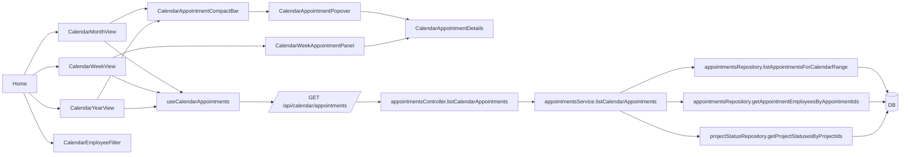

# PR #30 - Umsetzungsdokumentation Kalenderansichten

## 1. Zweck und Scope
Diese Dokumentation beschreibt den Umsetzungsstand fuer den Auftrag:
`Implement real-data calendar views with templates, DnD, filters and server endpoint (#30)`.

Betrachteter Stand: Branch `codex/implement-calendar-views-with-templates-and-filters`.

## 2. Ergebnis auf einen Blick
Im Rahmen des Auftrags wurde die Kalenderfunktion von statischen/demo-nahen Darstellungen auf eine echte, servergestuetzte Terminansicht umgebaut.

Kernfunktionen:
- Monats-, Wochen- und Jahresansicht mit echten Termindaten.
- Einheitlicher Mitarbeiter-Filter ueber alle Kalenderansichten.
- Drag-and-Drop zum Verschieben von Terminen inkl. Mehrtages-Terminen.
- Sperrlogik fuer vergangene/aktuelle Termine (Nicht-Admin eingeschraenkt).
- Neuer dedizierter API-Endpunkt fuer Kalendertermine inkl. angereicherter Daten.
- Wiederverwendbare UI-Bausteine fuer Terminanzeige (kompakt + Detail).

## 3. Komponenten und Verantwortungen

### 3.1 Frontend
| Komponente | Verantwortung | Datei |
|---|---|---|
| Home Navigation | Kalenderansichten einbetten, Filterzustand halten, Dialog-Ansicht bereitstellen | `client/src/pages/Home.tsx` |
| CalendarGrid Wrapper | Legacy-Einstiegspunkt, delegiert auf neue Monatsansicht | `client/src/components/CalendarGrid.tsx` |
| WeekGrid Wrapper | Legacy-Einstiegspunkt, delegiert auf neue Wochenansicht | `client/src/components/WeekGrid.tsx` |
| CalendarMonthView | Monatsraster, Lane-Berechnung, DnD, Terminstart, Terminoeffnen | `client/src/components/calendar/CalendarMonthView.tsx` |
| CalendarWeekView | Wochenlayout mit Detail-Panels, DnD, Terminstart, Terminoeffnen | `client/src/components/calendar/CalendarWeekView.tsx` |
| CalendarYearView | 12-Monats-Uebersicht, kompakte Verdichtung pro Tag, DnD | `client/src/components/calendar/CalendarYearView.tsx` |
| CalendarEmployeeFilter | Laden/Auswahl aktiver Mitarbeiter fuer globale Kalenderfilterung | `client/src/components/calendar/CalendarEmployeeFilter.tsx` |
| CalendarAppointmentCompactBar | Kompakte Terminleiste (Monat/Jahr), Hover-Popover, DnD-Hooks | `client/src/components/calendar/CalendarAppointmentCompactBar.tsx` |
| CalendarWeekAppointmentPanel | Detailkarte je Termin in Wochenansicht | `client/src/components/calendar/CalendarWeekAppointmentPanel.tsx` |
| CalendarAppointmentPopover | Overlay-Container fuer Termin-Details | `client/src/components/calendar/CalendarAppointmentPopover.tsx` |
| CalendarAppointmentDetails | Wiederverwendetes Detail-Template fuer Popover/Panel | `client/src/components/calendar/CalendarAppointmentDetails.tsx` |
| useCalendarAppointments Hook | Query-Key, API-Aufruf, Typisierung der Kalenderdaten | `client/src/lib/calendar-appointments.ts` |
| calendar-utils | Datums-/Sortier-/Farbhilfen fuer Kalenderkomponenten | `client/src/lib/calendar-utils.ts` |

### 3.2 Backend
| Schicht | Verantwortung | Datei |
|---|---|---|
| Route | Registrierung des neuen Endpunkts `/api/calendar/appointments` | `server/routes/appointmentsRoutes.ts` |
| Controller | Validierung Query-Parameter (`fromDate`, `toDate`, optional `employeeId`) | `server/controllers/appointmentsController.ts` |
| Service | Aggregation/Anreicherung: Projekt, Kunde, Tour, Mitarbeiter, Status, Lock-Flag | `server/services/appointmentsService.ts` |
| Repository (Appointments) | Kalender-Range-Query, Termin-Mitarbeiter-Zuordnung | `server/repositories/appointmentsRepository.ts` |
| Repository (Status) | Batch-Lookup Projektstatus pro Projektmenge | `server/repositories/projectStatusRepository.ts` |
| Shared Contract | API-Schema fuer Kalenderantwort (Zod) | `shared/routes.ts` |

## 4. Relationen (Architektur)

## 5. Datenfluss der wichtigsten Use Cases

### 5.1 Kalender laden
1. Ansicht berechnet Datumsintervall (`fromDate`, `toDate`).
2. `useCalendarAppointments` ruft `/api/calendar/appointments` mit Header `x-user-role` auf.
3. Controller validiert Query-Parameter.
4. Service laedt Grunddaten + Mitarbeiter + Projektstatus, baut Antwortobjekt.
5. Frontend rendert je Ansicht (Monat/Woche/Jahr) mit gemeinsamer Datengrundlage.

### 5.2 Mitarbeiter filtern
1. `CalendarEmployeeFilter` laedt aktive Mitarbeiter ueber `/api/employees`.
2. Ausgewaehlte `employeeId` wird im Home-State gehalten.
3. Views geben `employeeId` in den Kalender-Hook.
4. Backend schraenkt Terminmenge auf Mitarbeiterbezug ein.

### 5.3 Termin per Drag-and-Drop verschieben
1. Drag startet in `CompactBar` oder `WeekAppointmentPanel`.
2. Drop-Zieldatum wird in der jeweiligen View verarbeitet.
3. Frontend sendet `PATCH /api/appointments/:id` mit neuem Start/Ende (Dauer bleibt erhalten).
4. Nach Erfolg: React-Query invalidiert `calendarAppointments`, Neuabruf erfolgt.

### 5.4 Sperrlogik
- Fachregel: Termine sind ab Startdatum gesperrt.
- Nicht-Admins: Oeffnen/Verschieben/Loeschen gesperrter Termine wird verhindert.
- Admins: duerfen gesperrte Termine weiterhin bearbeiten.
- Umsetzung: Lock-Berechnung im Service (`isLocked`) + UI-Blockade/Toasts im Frontend.

## 6. Antwortmodell des Kalender-Endpunkts
Der neue Endpunkt liefert pro Termin ein aggregiertes Modell mit:
- Projektstammdaten (`projectName`, `projectDescription`)
- Projektstatusliste (`projectStatuses[]`)
- Zeitfenster (`startDate`, `endDate`, `startTime`)
- Tour-Infos (`tourId`, `tourName`, `tourColor`)
- Kundendaten (`customer`)
- Mitarbeiterliste (`employees[]`)
- Bearbeitbarkeit (`isLocked`)

Contract liegt in `shared/routes.ts` unter `api.calendarAppointments.list`.

## 7. Umsetzungsentscheidungen (aus QA-Log)
Quelle: `logs/calendar-views/abnahme.md`
- Eigener Kalender-API-Endpunkt statt Demo-Daten.
- Monat/Jahr verwenden gemeinsame kompakte Terminbausteine.
- Wochenansicht zeigt detailreiche Panels.
- Popover bleibt zentrale Detaildarstellung fuer kompakte Ansichten.
- Nicht umgesetzt: Kartenansicht (fehlende Geokoordinaten im Schema).

## 8. Bekannte Auffaelligkeit im aktuellen Branch-Stand
In `server/repositories/appointmentsRepository.ts` werden in der aktuellen Fassung Variablen genutzt, die in dem Scope nicht definiert sind (`toDate`, `fromDate`, `employeeAppointmentIdsQuery`, `conditions`).

Betroffene Bereiche:
- `getAppointmentEmployeesByAppointmentIds(...)`
- `listAppointmentsForCalendarRange(...)`

Empfehlung: Vor Merge Build/Typecheck fuer diesen Branch explizit laufen lassen und Query-Bedingungen im Repository final bereinigen.

## 9. Test- und Abnahmehinweise
Manuelle Kernchecks sind in `logs/calendar-views/abnahme.md` dokumentiert, u.a.:
- Termin anlegen aus allen 3 Ansichten.
- Termin per Klick oeffnen und speichern.
- Hover-Popover mit Projektdetails/Kundendaten/Status/Mitarbeitern.
- DnD inkl. Mehrtages-Logik und Persistenz.
- Sperrlogik Admin vs. Nicht-Admin.
- Konsistente Mitarbeiterfilterung ueber alle Ansichten.
- Gleiches Verhalten im Kalender-Dialog.
