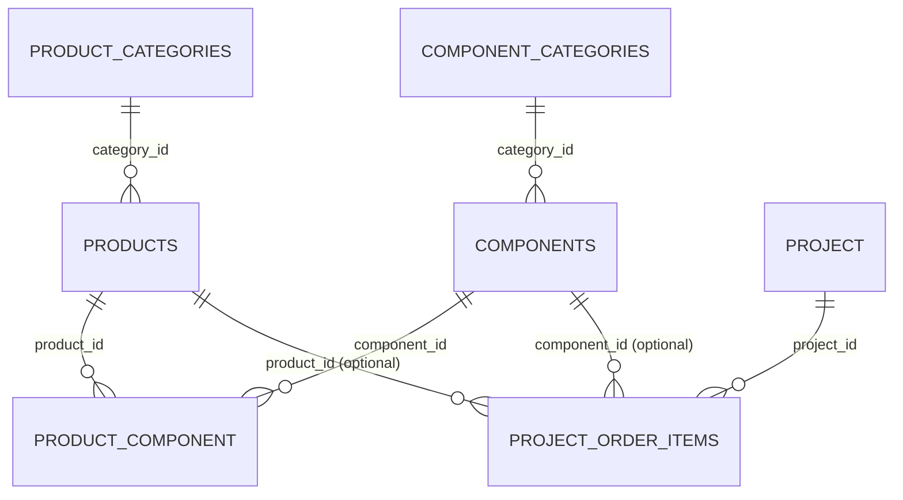

# Schemaüberblick Produkt- und Komponentenverwaltung

Basis ist der aktuelle Ist-Stand in `shared/schema.ts`, ergänzt um die tatsächlich genutzten Master-Data-Beziehungen in `server/repositories/masterDataRepository.ts` und die Admin-Contracts in `shared/routes.ts`.

## Diagramm

## Tabellen

### `product_categories`

Zweck: Kategorien für Produkte.

Wichtige Spalten:

- `id`
- `name` `UNIQUE`
- `is_active`
- `version`
- `created_at`
- `updated_at`

### `products`

Zweck: eigentliche Produkte.

Wichtige Spalten:

- `id`
- `name` `UNIQUE`
- `category_id` `FK -> product_categories.id`
- `description`
- `is_active`
- `version`
- `created_at`
- `updated_at`

### `component_categories`

Zweck: Kategorien für Komponenten/Modelle.

Wichtige Spalten:

- `id`
- `name` `UNIQUE`
- `is_active`
- `version`
- `created_at`
- `updated_at`

### `components`

Zweck: eigentliche Komponenten.

Wichtige Spalten:

- `id`
- `name` `UNIQUE`
- `category_id` `FK -> component_categories.id`
- `description`
- `is_active`
- `version`
- `created_at`
- `updated_at`

### `product_component`

Zweck: m:n-Zuordnung zwischen Produkten und Komponenten.

Wichtige Spalten:

- `product_id` `FK -> products.id`
- `component_id` `FK -> components.id`
- `version`

Schlüssel und Indizes:

- Primärschlüssel: `product_id`, `component_id`
- Index: `idx_pc_component_product (component_id, product_id)`

### `project_order_items`

Zweck: fachliche Verwendung von Produkt oder Komponente in einem Projektauftrag.

Wichtige Spalten:

- `id`
- `project_id` `FK -> project.id`
- `product_id` `FK -> products.id` optional
- `component_id` `FK -> components.id` optional
- `description` optional
- `quantity`
- `source`
- `version`
- `created_at`
- `updated_at`

Fachliche Regel:

- `source = 'product'` -> nur `product_id`
- `source = 'component'` -> nur `component_id`
- `source = 'text'` -> nur `description`

Zusätzlich erzwingt ein DB-Check, dass immer genau eine dieser Quellen aktiv ist.

## Kurzinterpretation

Das Modell ist aktuell vierstufig:

1. Produktkategorie -> Produkt
2. Komponentenkategorie -> Komponente
3. Produkt <-> Komponente als m:n-Mapping
4. Projektauftrag referenziert später entweder ein Produkt, eine Komponente oder Freitext

Auffällig im Ist-Stand:

- Die Pflege der Produkt-Komponenten-Zuordnung läuft API-seitig komponentenseitig über `PUT /api/admin/master-data/components/:id/products`.
- Die Join-Tabelle `product_component` modelliert keine Mengen oder Reihenfolgen, nur die reine Zuordnung.
- Mengen liegen erst auf `project_order_items.quantity`, also im Projektkontext.
